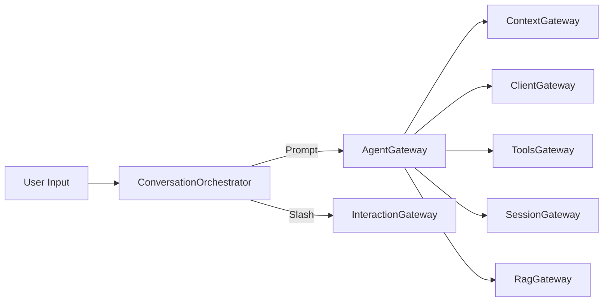

# Nexus

<div align="center">
  <pre>
███╗   ██╗███████╗██╗  ██╗██╗   ██╗███████╗
████╗  ██║██╔════╝╚██╗██╔╝██║   ██║██╔════╝
██╔██╗ ██║█████╗   ╚███╔╝ ██║   ██║███████╗
██║╚██╗██║██╔══╝   ██╔██╗ ██║   ██║╚════██║
██║ ╚████║███████╗██╔╝ ██╗╚██████╔╝███████║
╚═╝  ╚═══╝╚══════╝╚═╝  ╚═╝ ╚═════╝ ╚══════╝
  </pre>
  <p><strong>一个面向终端的 Python Coding Agent CLI</strong></p>
  <p>Conversation Orchestration · Context Governance · Local Tools · MCP · RAG · Session Persistence</p>
</div>

| Runtime | Architecture | Extensions |
| --- | --- | --- |
| Python 3.12+ | Gateway/Facade + Contracts | Local Tools + MCP + RAG |

Nexus 是一个面向终端的 Python Coding Agent CLI。它把对话编排、上下文治理、工具调用、会话持久化和 RAG 检索增强组合在一起，形成一个可交互、可扩展的本地代理运行时。

项目采用 Gateway/Facade + Contracts 架构：每个领域模块通过单一 Gateway 对外暴露能力，跨模块的数据结构和协议统一收敛到 `src/core_contracts/`，组合根位于 `src/main.py`。

> [!TIP]
> 如果你只想快速验证最小闭环：安装依赖，配置 `OPENAI_API_KEY`，运行 `python -m src.main`，然后输入 `/help`。

## ✨ Features

- 🤖 **Agent 主循环**：用户输入 -> 上下文治理 -> LLM 调用 -> 工具执行 -> 继续迭代，默认最多 5 轮工具/模型往返。
- 🧠 **Context 治理**：包含 token 预算预估、软上限裁剪、超长保护、自动压缩和上下文长度错误后的响应式压缩。
- 🛠 **Local Tools**：内置 `list_dir`、`read_file`、`write_file`、`edit_file`、`bash` 五类本地工具。
- 🔌 **MCP 扩展**：支持从 `.nexus/mcp.json` 加载 MCP 工具，并采用后台异步并行加载，保证本地工具可立即使用。
- 📚 **RAG 能力**：支持对目录或单文件建立索引，并基于检索结果构建问答提示词。
- 📄 **文档格式支持**：除常见文本/代码文件外，还支持 PDF、DOCX、XLSX、PPTX。
- 💾 **会话管理**：支持新建、保存、加载会话，退出时自动将会话快照保存到 `.nexus/sessions/`。
- ⌨️ **交互体验**：在可用环境中启用 `prompt_toolkit` 的 slash 自动补全；不可用时自动降级到普通输入。

## 🧱 Architecture



| 模块 | 入口 | 说明 |
| --- | --- | --- |
| `agent/` | `AgentGateway` | 编排主循环、工具执行和 REPL 输入分流。 |
| `client/` | `ClientGateway` | 封装 OpenAI SDK，负责聊天模型调用。 |
| `context/` | `ContextGateway` | 负责 token 预算、snip、compact 和上下文守卫。 |
| `tools/` | `ToolsGateway` | 聚合本地工具与 MCP 工具，统一执行接口。 |
| `interaction/` | `InteractionGateway` | 负责终端渲染、slash 命令解析/分发和输入读取。 |
| `session/` | `SessionGateway` | 会话状态创建、恢复和 JSON 快照持久化。 |
| `rag/` | `RagGateway` | 文档加载、分块、嵌入、向量检索与 RAG 提示词构建。 |
| `core_contracts/` | contracts only | 跨模块共享的 dataclass、协议和配置契约。 |

主运行流如下：

1. `python -m src.main` 启动应用。
2. `Application.run()` 从环境变量读取模型配置并装配所有 Gateway。
3. `ConversationOrchestrator` 进入 REPL，分流普通 prompt 与 slash 命令。
4. 普通 prompt 进入 `AgentGateway.run()`，执行上下文治理、模型调用和工具回合。
5. slash 命令由 `interaction` 解析并交给 `agent/slash_commands.py` 中的处理器执行。

## 📦 Requirements

- Python 3.12+
- 有效的 `OPENAI_API_KEY`
- 已安装 `pip`

项目是纯 Python 仓库，没有单独的 build 步骤，也没有配置 linter 或 type checker。

## ⚙️ Installation

安装运行依赖与测试依赖：

```bash
python -m pip install -r requirements.txt pytest
```

如果希望获得更好的交互输入体验和 slash 自动补全，额外安装：

```bash
python -m pip install prompt_toolkit
```

`requirements.txt` 当前包含的核心依赖：

- `openai`
- `pypdf`
- `python-docx`
- `openpyxl`
- `python-pptx`

## 🔐 Environment Variables

| 变量 | 必需 | 默认值 | 说明 |
| --- | --- | --- | --- |
| `OPENAI_API_KEY` | 是 | - | OpenAI 或兼容接口的 API Key。 |
| `OPENAI_BASE_URL` | 否 | 官方默认地址 | 自定义模型服务地址。 |
| `OPENAI_MODEL` | 否 | `gpt-4o` | 默认聊天模型名称。 |
| `OPENAI_TEMPERATURE` | 否 | `0.7` | 采样温度。 |
| `OPENAI_MAX_TOKENS` | 否 | `4096` | 单次生成的默认最大输出 token。 |
| `RAG_EMBEDDING_MODEL` | 否 | `text-embedding-3-small` | RAG embeddings 模型。 |
| `OPENAI_EMBEDDING_MODEL` | 否 | `text-embedding-3-small` | `RAG_EMBEDDING_MODEL` 未设置时的后备值。 |

PowerShell 示例：

```powershell
$env:OPENAI_API_KEY = "your_api_key"
$env:OPENAI_MODEL = "gpt-4o"
python -m src.main
```

Bash 示例：

```bash
export OPENAI_API_KEY="your_api_key"
export OPENAI_MODEL="gpt-4o"
python -m src.main
```

## 🚀 Quick Start

安装依赖后，直接从仓库根目录启动：

```bash
python -m src.main
```

启动后会进入交互式 REPL。普通文本会作为用户 prompt 进入代理主循环，以 `/` 开头的输入会被识别为 slash 命令。

一个最小上手流程：

```text
/help
/status
/rag-index docs
/rag-ask 这个项目的核心架构是什么？
/save
/exit
```

> [!NOTE]
> `/rag-index` 会建立当前进程内的 RAG 集合；如果你是第一次运行，建议先从 `docs/` 或单个 Markdown 文件开始试。

## 🧭 Slash Commands

当前默认注册的命令如下：

| 分类 | 命令 | 说明 |
| --- | --- | --- |
| 基础 | `/help` | 查看全部本地 slash 命令。 |
| 诊断 | `/context` | 查看当前上下文、预算和压缩相关状态。 |
| 诊断 | `/status` | 查看当前会话 ID、模型名、工作目录和轮次状态。 |
| 诊断 | `/permissions` | 查看当前工具权限推断结果。 |
| MCP | `/mcp` | 列出已连接的 MCP server 状态。 |
| MCP | `/mcp <server>` | 查看某个 MCP server 的工具列表。 |
| 会话 | `/new` | 创建一个新会话。 |
| 会话 | `/clear` | 清空当前内存上下文并 fork 新会话。 |
| 会话 | `/save` | 将当前会话保存到 `.nexus/sessions/`。 |
| 会话 | `/load <session_id>` | 从会话快照恢复会话。 |
| RAG | `/rag-index <file-or-dir>` | 对文件或目录建立 RAG 索引。 |
| RAG | `/rag-ask <question>` | 基于 RAG 检索结果向模型提问。 |
| Context | `/compact` | 手动触发上下文压缩。 |
| 退出 | `/exit` / `/quit` | 退出当前交互。 |

说明：

- slash 命令支持唯一前缀匹配，例如 `/st` 可匹配 `/status`。
- `/rag-index` 当前会将内容索引到固定集合 `main-loop`。
- `/rag-ask` 会把问题与检索到的分块拼成提示词，再调用聊天模型生成答案。

## 🛠 Built-in Tools

Nexus 启动后会立即具备以下本地工具能力：

| 类型 | 工具 | 说明 |
| --- | --- | --- |
| 文件系统 | `list_dir` | 列出工作区内目录内容。 |
| 文件系统 | `read_file` | 按文件或按行区间读取文本。 |
| 文件系统 | `write_file` | 写入文件，不存在时自动创建父目录。 |
| 文件系统 | `edit_file` | 基于精确文本替换编辑文件。 |
| Shell | `bash` | 在工作区根目录执行 shell 命令。 |

当存在 MCP 配置时，远程工具会在后台并行加载；如果 MCP 工具名与本地工具名冲突，系统会自动为远程工具添加 `mcp_` 前缀。

## 🔌 MCP Configuration

默认 MCP 配置文件路径为 `.nexus/mcp.json`。如果该文件不存在，Nexus 仍可正常启动，只是不会加载远程 MCP 工具。

> [!TIP]
> 本地工具会先可用，MCP 工具随后在后台异步并行接入，所以首次启动不会被远程 server 阻塞。

一个最小配置示例：

```json
{
  "mcpServers": {
    "filesystem": {
      "transport": "stdio",
      "command": "npx",
      "args": [
        "-y",
        "@modelcontextprotocol/server-filesystem",
        "."
      ]
    },
    "demo-http": {
      "transport": "streamable-http",
      "url": "http://localhost:8000/mcp"
    }
  }
}
```

支持的传输方式：

- `stdio`：通过子进程标准输入输出进行 JSON-RPC 通信。
- HTTP 类传输：当前实现会对非 `stdio` 传输按 HTTP JSON-RPC 请求处理，可用于 `streamable-http` 场景。

## 📚 RAG Notes

RAG 子系统当前具有以下特点：

- 文档加载支持单文件和目录递归扫描。
- 分块器采用带 overlap 的滑动窗口策略，并优先在自然语义边界处分块。
- 向量存储是纯 Python 进程内内存存储，使用余弦相似度进行线性检索。
- 检索命中会被格式化为参考资料，再与用户问题组合成最终提示词。

常见用法：

```text
/rag-index docs
/rag-index README.md
/rag-ask MCP 工具是如何接入这个项目的？
```

## 💾 Session Persistence

- 会话快照默认保存在 `.nexus/sessions/<session_id>.json`
- `/save` 可显式落盘
- `/load <session_id>` 可恢复历史会话
- 正常退出时，应用也会自动尝试保存当前会话

这让 Nexus 同时具备短时交互和长会话续跑能力。

## 🗂 Project Structure

```text
.
|- src/
|  |- main.py
|  |- agent/
|  |- client/
|  |- context/
|  |- core_contracts/
|  |- interaction/
|  |- rag/
|  |- session/
|  \- tools/
|- test/
|- docs/
|- scripts/
\- requirements.txt
```

测试目录与源码目录镜像对应，例如：

- `src/context/compactor.py` <-> `test/context/test_compactor.py`
- `src/rag/rag_gateway.py` <-> `test/rag/test_rag_gateway.py`

## ✅ Test

运行完整测试：

```bash
python -m pytest test/ -v
```

运行单个测试文件：

```bash
python -m pytest test/context/test_compactor.py -v
```

运行单个测试用例：

```bash
python -m pytest test/context/test_compactor.py::test_compact_reduces_message_count -v
```

## 📖 Related Docs

- [MCP Tools 异步并行加载优化](docs/Agent%20%E5%90%AF%E5%8A%A8%E6%80%A7%E8%83%BD%E4%BC%98%E5%8C%96%EF%BC%9AMCP%20Tools%20%E5%BC%82%E6%AD%A5%E5%B9%B6%E8%A1%8C%E5%8A%A0%E8%BD%BD.md)
- [RAG 文档切分与检索优化](docs/RAG%20%E6%A8%A1%E5%9D%97%E4%BC%98%E5%8C%96%EF%BC%9A%E6%96%87%E6%A1%A3%E5%88%87%E5%88%86%E6%96%AD%E7%82%B9%E4%BF%AE%E6%AD%A3%20%2B%20Top-K%20%E5%A0%86%E6%8E%92%E5%BA%8F%E6%A3%80%E7%B4%A2.md)

## 📄 License

当前仓库未提供单独的许可证声明。如需开源分发，请补充明确的 License 文件。